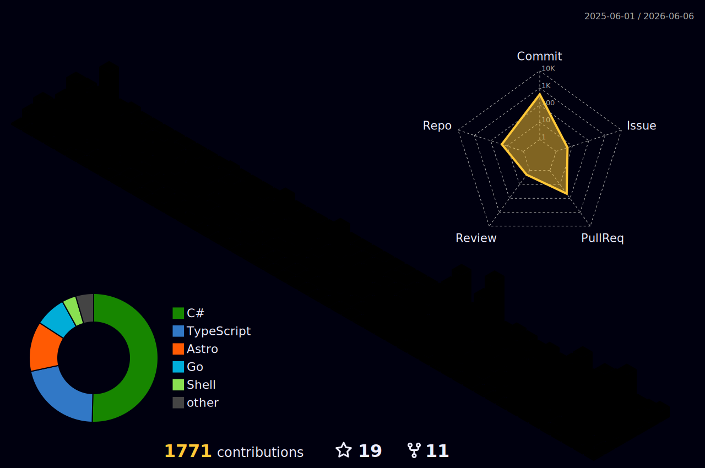

<h1>Hi 👋, I'm Vladimir</h1>

<h3>I'm a Node.js developer with a love for open-source and Linux. I am also author of the <a href="https://elevatech.xyz/" target="_blank">No.1 hiring platform</a>. Feel free to apply for a position, they are always hiring.</h3>


<h2>📪 Contact me</h2>
<p>
<a target="_blank" href="https://www.linkedin.com/in/vladdimir/">

</a>
</p>


[](https://github.com/utajum)


<!--START_SECTION:waka-->

**🐱 My GitHub Data** 

> 📦 2.7 MB Used in GitHub's Storage 
 > 
> 🏆 434 Contributions in the Year 2024
 > 
> 📜 84 Public Repositories 
 > 
> 🔑 30 Private Repositories 
 > 
**I'm a Night 🦉** 

```text
🌞 Morning                6 commits           ░░░░░░░░░░░░░░░░░░░░░░░░░   00.86 % 
🌆 Daytime                275 commits         ██████████░░░░░░░░░░░░░░░   39.23 % 
🌃 Evening                215 commits         ████████░░░░░░░░░░░░░░░░░   30.67 % 
🌙 Night                  205 commits         ███████░░░░░░░░░░░░░░░░░░   29.24 % 
```
📅 **I'm Most Productive on Monday** 

```text
Monday                   189 commits         ███████░░░░░░░░░░░░░░░░░░   26.96 % 
Tuesday                  144 commits         █████░░░░░░░░░░░░░░░░░░░░   20.54 % 
Wednesday                61 commits          ██░░░░░░░░░░░░░░░░░░░░░░░   08.70 % 
Thursday                 149 commits         █████░░░░░░░░░░░░░░░░░░░░   21.26 % 
Friday                   24 commits          █░░░░░░░░░░░░░░░░░░░░░░░░   03.42 % 
Saturday                 131 commits         █████░░░░░░░░░░░░░░░░░░░░   18.69 % 
Sunday                   3 commits           ░░░░░░░░░░░░░░░░░░░░░░░░░   00.43 % 
```


**I Mostly Code in JavaScript** 

```text
JavaScript               24 repos            ██████████░░░░░░░░░░░░░░░   39.34 % 
TypeScript               23 repos            █████████░░░░░░░░░░░░░░░░   37.70 % 
Shell                    7 repos             ███░░░░░░░░░░░░░░░░░░░░░░   11.48 % 
HTML                     2 repos             █░░░░░░░░░░░░░░░░░░░░░░░░   03.28 % 
Kotlin                   1 repo              ░░░░░░░░░░░░░░░░░░░░░░░░░   01.64 % 
```


 Last Updated on 22/10/2024 23:11:01 UTC
<!--END_SECTION:waka-->




<h2>🛠 Skills</h2>

<p align="center">
  <a href="https://skillicons.dev">
    
  </a>
</p>

<p align="center">
  
  
  
  
  
  
</p>


