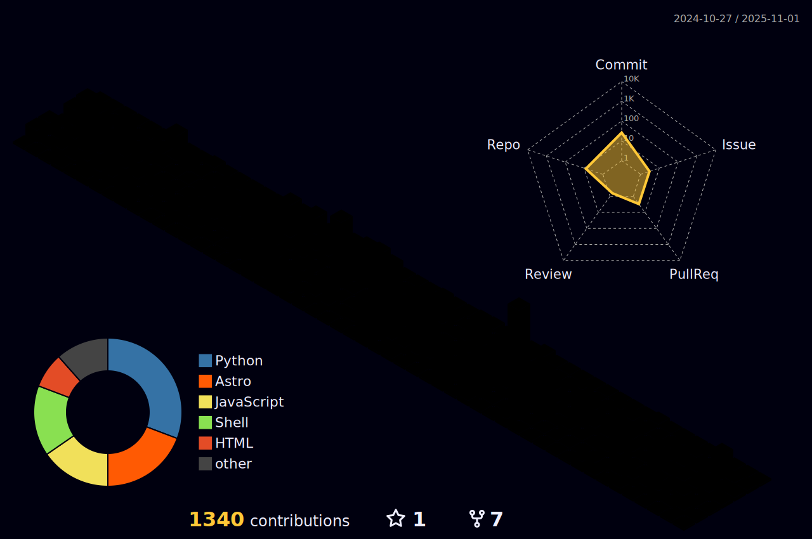

<!-- <a href="https://github.com/utajum" target="_blank">

</a> -->

<h1>Hi 👋, I'm Vladimir</h1>

<h3>I'm a Node.js developer with a love for open-source and Linux. I am also author of the <a href="https://elevatech.xyz/" target="_blank">No.1 hiring platform</a>. Feel free to apply for a position, they are always hiring.</h3>


<h2>📪 Contact me</h2>
<p>
<a target="_blank" href="https://www.linkedin.com/in/vladdimir/" target="_blank" style="display: inline-block;">

</a>    
</p>


<!--START_SECTION:waka-->


**🐱 My GitHub Data** 

> 📦 2.7 MB Used in GitHub's Storage 
 > 
> 🏆 434 Contributions in the Year 2024
 > 
> 🚫 Not Opted to Hire
 > 
> 📜 84 Public Repositories 
 > 
> 🔑 30 Private Repositories 
 > 
**I'm a Night 🦉** 

```text
🌞 Morning                6 commits           ░░░░░░░░░░░░░░░░░░░░░░░░░   00.86 % 
🌆 Daytime                275 commits         ██████████░░░░░░░░░░░░░░░   39.23 % 
🌃 Evening                215 commits         ████████░░░░░░░░░░░░░░░░░   30.67 % 
🌙 Night                  205 commits         ███████░░░░░░░░░░░░░░░░░░   29.24 % 
```
📅 **I'm Most Productive on Monday** 

```text
Monday                   189 commits         ███████░░░░░░░░░░░░░░░░░░   26.96 % 
Tuesday                  144 commits         █████░░░░░░░░░░░░░░░░░░░░   20.54 % 
Wednesday                61 commits          ██░░░░░░░░░░░░░░░░░░░░░░░   08.70 % 
Thursday                 149 commits         █████░░░░░░░░░░░░░░░░░░░░   21.26 % 
Friday                   24 commits          █░░░░░░░░░░░░░░░░░░░░░░░░   03.42 % 
Saturday                 131 commits         █████░░░░░░░░░░░░░░░░░░░░   18.69 % 
Sunday                   3 commits           ░░░░░░░░░░░░░░░░░░░░░░░░░   00.43 % 
```


📊 **This Week I Spent My Time On** 

```text
💬 Programming Languages: 
No Activity Tracked This Week
```

**I Mostly Code in JavaScript** 

```text
JavaScript               24 repos            ██████████░░░░░░░░░░░░░░░   39.34 % 
TypeScript               23 repos            █████████░░░░░░░░░░░░░░░░   37.70 % 
Shell                    7 repos             ███░░░░░░░░░░░░░░░░░░░░░░   11.48 % 
HTML                     2 repos             █░░░░░░░░░░░░░░░░░░░░░░░░   03.28 % 
Kotlin                   1 repo              ░░░░░░░░░░░░░░░░░░░░░░░░░   01.64 % 
```


 Last Updated on 22/10/2024 23:11:01 UTC
<!--END_SECTION:waka-->




<h2>🛠 Skills</h2>
<p>


<a target="_blank" href="https://deno.land/" target="_blank" style="display: inline-block;">

</a>


<a target="_blank" href="https://reactjs.org/" target="_blank" style="display: inline-block;">

</a>

<a target="_blank" href="https://astro.build/" target="_blank" style="display: inline-block;">

</a>


<a target="_blank" href="https://www.serverless.com/" target="_blank" style="display: inline-block;">

</a>

<a target="_blank" href="https://www.linux.org/" target="_blank" style="display: inline-block;">

</a>

<a target="_blank" href="https://aws.amazon.com/eventbridge/" target="_blank" style="display: inline-block;">

</a>

<a target="_blank" href="https://aws.amazon.com/dynamodb/" target="_blank" style="display: inline-block;">

</a>

<a target="_blank" href="https://aws.amazon.com/lambda/" target="_blank" style="display: inline-block;">

</a>

<a target="_blank" href="https://aws.amazon.com/s3/" target="_blank" style="display: inline-block;">

</a>


<a target="_blank" href="https://nextjs.org/" target="_blank" style="display: inline-block;">

</a>


<a target="_blank" href="https://www.w3schools.com/css/" target="_blank" style="display: inline-block;">

</a>


<a target="_blank" href="https://sass-lang.com" target="_blank" style="display: inline-block;">

</a>


<a target="_blank" href="https://tailwindcss.com/" target="_blank" style="display: inline-block;">

</a>


<a target="_blank" href="https://babeljs.io/" target="_blank" style="display: inline-block;">

</a>


<a target="_blank" href="https://webpack.js.org" target="_blank" style="display: inline-block;">

</a>


<a target="_blank" href="https://redux.js.org" target="_blank" style="display: inline-block;">

</a>


<a target="_blank" href="https://nodejs.org" target="_blank" style="display: inline-block;">

</a>


<a target="_blank" href="https://expressjs.com" target="_blank" style="display: inline-block;">

</a>


<a target="_blank" href="https://www.fastify.io/" target="_blank" style="display: inline-block;">

</a>


<a target="_blank" href="https://nestjs.com/" target="_blank" style="display: inline-block;">

</a>


<a target="_blank" href="https://graphql.org" target="_blank" style="display: inline-block;">

</a>


<a target="_blank" href="https://www.rabbitmq.com" target="_blank" style="display: inline-block;">

</a>


<a target="_blank" href="https://www.nginx.com" target="_blank" style="display: inline-block;">

</a>


<a target="_blank" href="https://kafka.apache.org/" target="_blank" style="display: inline-block;">

</a>


<a target="_blank" href="https://ionicframework.com" target="_blank" style="display: inline-block;">

</a>


<a target="_blank" href="https://cordova.apache.org/" target="_blank" style="display: inline-block;">

</a>


<a target="_blank" href="https://reactnative.dev/" target="_blank" style="display: inline-block;">

</a>


<a target="_blank" href="https://www.mysql.com/" target="_blank" style="display: inline-block;">

</a>


<a target="_blank" href="https://www.mongodb.com/" target="_blank" style="display: inline-block;">

</a>


<a target="_blank" href="https://www.postgresql.org" target="_blank" style="display: inline-block;">

</a>


<a target="_blank" href="https://redis.io" target="_blank" style="display: inline-block;">

</a>


<a target="_blank" href="https://www.oracle.com/" target="_blank" style="display: inline-block;">

</a>


<a target="_blank" href="https://www.sqlite.org/" target="_blank" style="display: inline-block;">

</a>


<a target="_blank" href="https://grafana.com" target="_blank" style="display: inline-block;">

</a>


<a target="_blank" href="https://aws.amazon.com" target="_blank" style="display: inline-block;">

</a>


<a target="_blank" href="https://www.docker.com/" target="_blank" style="display: inline-block;">

</a>


<a target="_blank" href="https://www.jenkins.io" target="_blank" style="display: inline-block;">

</a>


<a target="_blank" href="https://cloud.google.com" target="_blank" style="display: inline-block;">

</a>


<a target="_blank" href="https://www.gnu.org/software/bash/" target="_blank" style="display: inline-block;">

</a>


<a target="_blank" href="https://azure.microsoft.com/en-in/" target="_blank" style="display: inline-block;">

</a>


<a target="_blank" href="https://www.vagrantup.com/" target="_blank" style="display: inline-block;">

</a>


<a target="_blank" href="https://circleci.com" target="_blank" style="display: inline-block;">

</a>


<a target="_blank" href="https://travis-ci.org" target="_blank" style="display: inline-block;">

</a>


<a target="_blank" href="https://aws.amazon.com/amplify/" target="_blank" style="display: inline-block;">

</a>


<a target="_blank" href="https://www.electronjs.org" target="_blank" style="display: inline-block;">

</a>


<a target="_blank" href="https://www.cypress.io" target="_blank" style="display: inline-block;">

</a>


<a target="_blank" href="https://www.selenium.dev" target="_blank" style="display: inline-block;">

</a>


<a target="_blank" href="https://jestjs.io" target="_blank" style="display: inline-block;">

</a>


<a target="_blank" href="https://mochajs.org" target="_blank" style="display: inline-block;">

</a>


<a target="_blank" href="https://github.com/puppeteer/puppeteer" target="_blank" style="display: inline-block;">

</a>


<a target="_blank" href="https://karma-runner.github.io/latest/index.html" target="_blank" style="display: inline-block;">

</a>


<a target="_blank" href="https://jasmine.github.io/" target="_blank" style="display: inline-block;">

</a>


<a target="_blank" href="https://www.figma.com/" target="_blank" style="display: inline-block;">

</a>


<a target="_blank" href="https://www.gatsbyjs.com/" target="_blank" style="display: inline-block;">

</a>


<a target="_blank" href="https://unrealengine.com/" target="_blank" style="display: inline-block;">

</a>


<a target="_blank" href="https://git-scm.com/" target="_blank" style="display: inline-block;">

</a>


<a target="_blank" href="https://www.arduino.cc/" target="_blank" style="display: inline-block;">

</a>


<a target="_blank" href="https://www.w3.org/html/" target="_blank" style="display: inline-block;">

</a>

</p>


